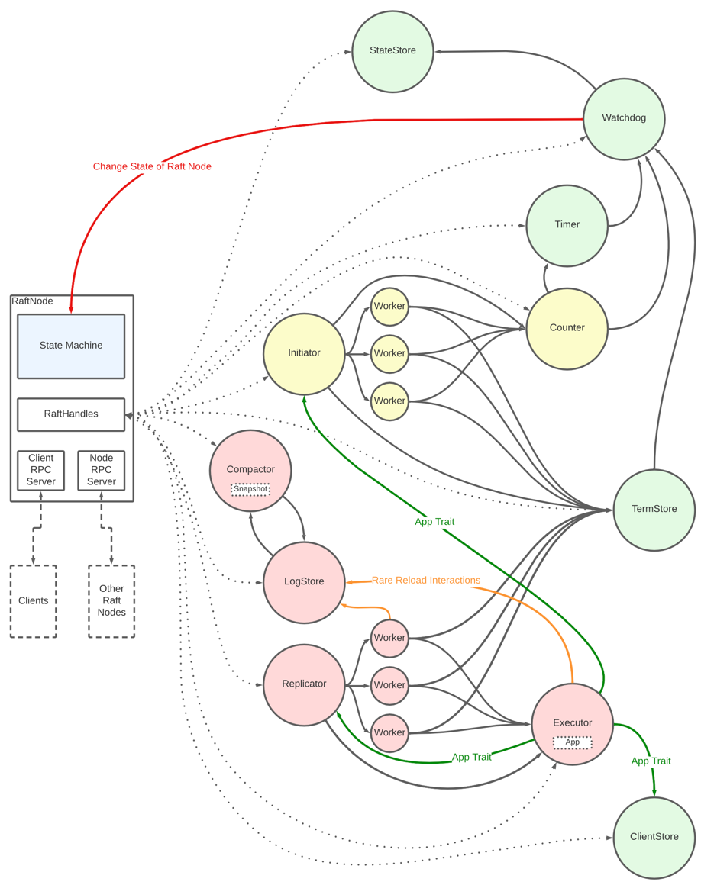

# Actor-Raft

Actor-Raft is an asynchronous actor-based Raft library in Rust.

The library provides:

- A **Node** with all the necessary components such as network implementations to communicate with
  other nodes and clients in the Raft cluster, or other critical components such as persistent storage. The Node uses
  actors which handle the fundamental steps of the Raft
  consensus algorithm. However, it currently lacks features like snapshots and online membership
  changes

- A **Client** library that integrates with the supplied node, for a quick and easy way to
  communicate with the cluster. With features including leader detection and exactly-once semantic

## Example

Node creation:

```Rust

// build RaftNode
let mut node = RaftNodeBuilder::new(app)
.with_id(id)
.with_ip("0.0.0.0")
.with_port(50055)
.with_service_port(55055)
.with_shutdown(shutdown_receiver)
.with_client_service_enabled(true)
.with_nodes(other_nodes)
.with_log_db_path("databases/log")
.with_term_db_path("databases/term")
.with_vote_db_path("databases/vote")
.build()
.await;

// start RaftNode
node.execute().await;

```

Client usage:

```Rust
// init client
let mut client = ClientBuilder::new().with_nodes(node_configs).build().await;

// use client
let answer = client.query(query_payload).await;
let result = client.command(command_payload).await;

```

Example of how to use the App trait to create a high-available Hashmap:

```Rust
#[derive(Serialize, Deserialize, Debug)]
pub struct HMInsert<'a> {
    pub key: u64,
    pub value: &'a str,
}

#[derive(Serialize, Deserialize, Debug)]
pub struct HMQuery {
    pub key: u64,
}

#[derive(Debug)]
pub struct HAHashMap {
    pub(crate) map: HashMap<u64, String>,
}

impl App for HAHashMap {
    fn run(
        &mut self,
        entry: Entry,
    ) -> BoxFuture<'_, Result<AppResult, Box<dyn Error + Send + Sync>>> {
        let future = async move {
            let query: HMInsert = bincode::deserialize(&entry.payload).unwrap();

            self.map.insert(query.key, query.value.to_string());

            let result_payload = bincode::serialize(
                format!("successful inserted: {}: {}", query.key, query.value).as_str(),
            )
                .unwrap();

            let result = AppResult {
                success: true,
                payload: result_payload,
            };
            Ok(result)
        };
        Box::pin(future)
    }

    fn query(
        &self,
        payload: Vec<u8>,
    ) -> BoxFuture<'_, Result<AppResult, Box<dyn Error + Send + Sync>>> {
        let future = async move {
            let query: HMQuery = bincode::deserialize(&payload).unwrap();

            let result_payload = bincode::serialize(self.map.get(&query.key).unwrap()).unwrap();

            let result = AppResult {
                success: true,
                payload: result_payload,
            };
            Ok(result)
        };
        Box::pin(future)
    }
}

```

## Overview of Node Actors:



## TODO:

- [ ] implement and test snapshot capabilities in compactor
- [ ] implement install_snapshot rpc
- [ ] implement online membership changes (details see executor todos)